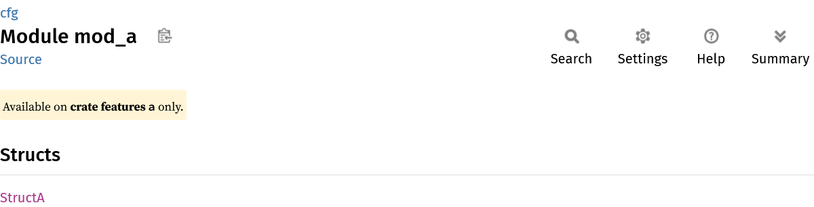
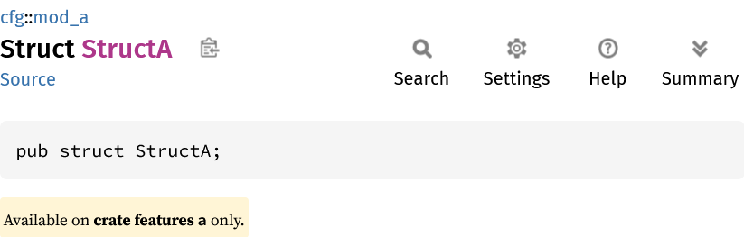
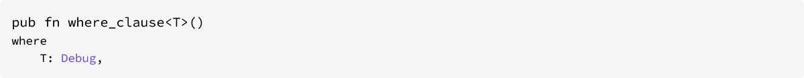

# What does rustdoc do?

Rustdoc does a load of stuff. 
Most notibly, rendering the HTML that contains your docs.
But before that, it does a load of transformations and analyses to get ready for that.
I want to focus of these passes that rustdoc does to go from rustc's IR's, to something that's ready to go to HTML.
Why?
Becasue it's interesting!
But also for other ressons.
[I'll explain later](https://www.youtube.com/watch?v=Do-wDPoC6GM).

## Propagate `#[doc(cfg)]`

If a `#[cfg(...)]` attribute is applied to a module, that cfg "logically" applies to all items in the module
(because if a module if `cfg`'d out, then all of it's children also won't get compiled).

In rustc, a `#[cfg(...)]` on a module needs to only be processed when considering whether to keep or drop that module during
cfg expansion.
But for `rustdoc`, it's important that we not only show the `#[cfg]` on the module, but the items in the module.
That way, when a user looks at an items documentation, they always know what cfg's will make it availible,
regardless if they're `#[cfg]`s on the item itself, or on a module containing the item.

```rust
#![feature(doc_cfg)]
#![doc(auto_cfg)]

#[cfg(any(doc, feature = "a"))]
pub mod mod_a {
    pub struct StructA;
}
```

Not only does the page for `mod mod_a` talk about `#[cfg(feature = "a")]`:



But so does the page for `struct A`:




## Inline locally

Rust has module-based visibility.
This means if you want a type to protect it's internals, it needs to be in it's own module.
For example, say your writing a collections library with a `HashMap` and a `LinkedList`.
Each of these types has their own private fields with their own invarients, and you need to make sure that everyone who can access the fields maintains the invariants.
Therefor it's nice to define each of them in their own module, so that `HashMap` can't see `LinkedList`s internals (and vice-versa).
However, this leads to having an ugly api, where users needs to deal with `collections::hash_map::HashMap` and `collections::linked_list::LinkedList`.
The solution to this is that rust allows you to "re-export" an item at a different location.
This means that an item can be defined in one module (for the purposes of visibility), and appear in another module (for the purposes of a nice API).


```rust
mod hash_map {
    pub struct HashMap;
}
mod linked_list {
    pub struct LinkedList;
}
pub use hash_map::HashMap;
pub use linked_list::LinkedList;
```

Instead of generating a page for `collections::hash_map::HashMap` and adding a `pub use crate::hash_map::HashMap` entry to the page for `collections`,
rustdoc will "inline" the definition, and make a page for `collections::HashMap` [^redirect].

(TODO: Images?)

Rustdoc kinda handles this in reverse to what rustc is doing.
rustc performs the re-naming lazily: When the nameres using this item hits the re-export, it "follows" that to the origal definition.
(TODO: Check this is right?)
Whereas rustdoc has to eagerly perform the move, so that the output matches what rustc will do.
(TODO: Does this make sense?) [^inline_json]

[^redirect]: And add a redirect from where `collections::hash_map::HashMap` would be, to avoid breaking links :3
[^inline_json]: But not for rustdoc-json. It caused too many bugs, and maybe wan't desirable (I'm not entirely sure if this was the right call).

## Re-sugar HIR

When rustc lowers from AST to HIR, it normalized and removes some details, to make code more uniform so their's less structure for future passes.

For exaple, there are multiple ways to write a bound on a generic param.

```rust
pub fn bound_on_def<T: Debug>() {}
pub fn where_clause<T>() where T: Debug {}
```

During AST->HIR lowering, bounds on generic params are converted to where clauses.
This way, the typechecker only needs to consider one source of bounds it needs to prove.
We can see this result by using `-Zunpretty=hir`:

```rust
fn bound_on_def<T>() where T: Debug { }
fn where_clause<T>() where T: Debug { }
```

But despite rustdoc processing HIR (and not the AST [^why_hir]) can tell them apart nonetheless:




This is because HIR tracks if a bound came from a where clause or a bound on the param definition.
This is done on a field on each [`WhereBoundPredicate`] that tracks if it came from a where clause or generic param.
Rustdoc can then use this field to re-associate certain bounds back to the generic param def.
In effect, rustdoc is undoing the de-sugaring of the AST->HIR pass.

[^why_hir]: Because the HIR has has name-resolution performed on it, and the AST doesn't. 
[`WhereBoundPredicate`]: https://doc.rust-lang.org/nightly/nightly-rustc/rustc_hir/hir/struct.WhereBoundPredicate.html

## Synthesize trait impls

(TODO: Talk about how Sync/Sync impls are injected straig into the trait solver, and how rustdoc is different).

## Resolve intra-doc-links

This is pretty self explanitory.

## Probably more...

(TODO: Ask people, find out).

## Why am I thinking about this?

This post is the first of an ongoing series tennitivly called "rustdoc-json design notes".

A question I often get is "why is rustdoc-json a part of rustdoc, and not rustc?".
The answer today is because of path-dependence (more on this in the future).
But I think a better long-term answer lies in these features listed here today.
But the question remains, do todays users of rustdoc-json benefit from these transformations that were designed around the needs of rustdoc-html? I'll leave you to ponder that. 